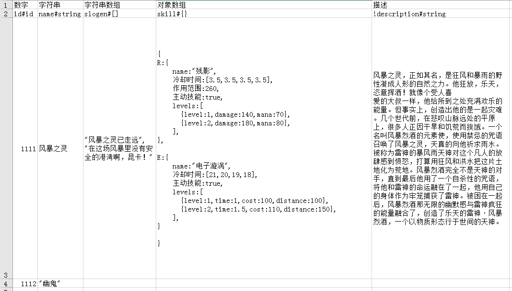
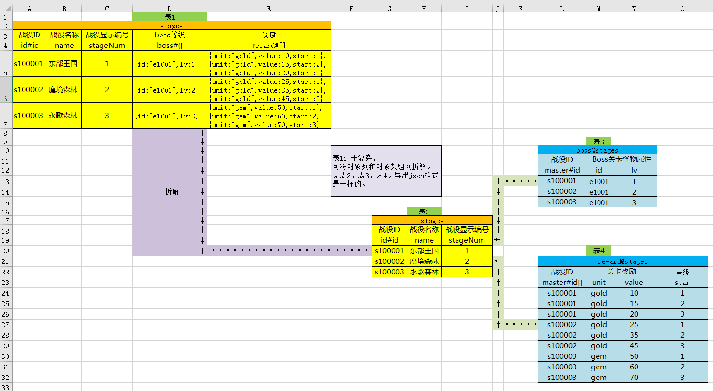

### xlsx2json ([English Document](./docs/doc_en.md))
> 让excel支持复杂的json格式, 将xlsx文件转成json。

### 更新日志
* 2018-6-8 v1.1.0
  - feature: 外键功能支持。
  - feature: 引入了一个新的库，更新(`git pull`)完需要运行下`npm install`安装依赖。
  - fix: 少量bug修复。

### 分支

* `master`为主分支,此分支用于发布版本，包含当前稳定代码，不要往主分支直接提交代码。
* `dev`为开发分支,新功能bug修复等提交到此分支，待稳定后合并到`master`分支。
* 如需当做npm模块引用请切换到`npm`分支(尚有功能未合并，暂时不可用)。

### 使用说明
* 目前只支持.xlsx格式，不支持.xls格式。
* 本项目是基于nodejs的，所以需要先安装nodejs环境。
* 执行命令
```bash
# Clone this repository
git clone https://github.com/koalaylj/xlsx2json.git
# Go into the repository
cd xlsx2json
# Install dependencies
npm install
```

* 配置config.json
```javascript
{
    "xlsx": {
        /**
         * 表头所在的行，第一行可以是注释，第二行是表头
         */
        "head": 2,

        /**
         * xlsx文件所在的目录
         * glob配置风格
         */
        "src": "./excel/**/[^~$]*.xlsx",

        /**
         * 导出的json存放的位置
         */
        "dest": "./json"
    },

    /**
     * 是否导出d.ts（for typescript）
     * 一张表格只导出一个d.ts文件
     * true:生成d.ts，false:不生成
     */
    "ts":false,

    "json": {
      /**
       * 导出的json是否需要压缩
       * true:压缩，false:不压缩(便于阅读的格式)
       */
      "uglify": false
    }
}
```
* 执行`export.sh|export.bat`即可将`./excel/*.xlsx` 文件导成json并存放到 `./json` 下。json名字以excel的sheet名字命名。

* 补充(一般用不上)：
    * 执行`node index.js -h` 查看使用帮助。
    * 命令行传参方式使用：执行 node `index.js --help` 查看。

#### 示例1 基本功能(参考./excel/basic.xlsx)   


输出如下(因为设置了`#id`列，输出`JsonHash`格式，如果无`#id`列则输出数组格式)：

```json
{
  "1111": {
    "id": 1111,
    "name": "风暴之灵",
    "slogen": ["风暴之灵已走远","在这场风暴里没有安全的港湾啊，昆卡！"],
    "skill": {
      "R": {
        "name": "残影",
        "冷却时间": [3.5,3.5,3.5,3.5],
        "作用范围": 260,
        "主动技能": true,
        "levels": [
          {"level": 1,"damage": 140,"mana": 70},
          {"level": 2,"damage": 180,"mana": 80}
        ]
      },
      "E": {
        "name": "电子漩涡",
        "冷却时间": [21,20,19,18],
        "主动技能": true,
        "levels": [
          {"level": 1,"time": 1,"cost": 100,"distance": 100},
          {"level": 2,"time": 1.5,"cost": 110,"distance": 150}
        ]
      }
    }
  },
  "1112": {
    "id": 1112,
    "name": "幽鬼",
    "slogen": null,
    "skill": null
  }
}
```

如果将第一列的`id#id`换成`id#string`则会输出`JsonArray`格式：

```json
[
  {
    "id": "1111",
    "name": "风暴之灵",
    "slogen": ["风暴之灵已走远","在这场风暴里没有安全的港湾啊，昆卡！"],
    "skill": {
      "R": {
        "name": "残影",
        "冷却时间": [3.5,3.5,3.5,3.5],
        "作用范围": 260,
        "主动技能": true,
        "levels": [
          {"level": 1,"damage": 140,"mana": 70},
          {"level": 2,"damage": 180,"mana": 80}
        ]
      },
      "E": {
        "name": "电子漩涡",
        "冷却时间": [21,20,19,18],
        "主动技能": true,
        "levels": [
          {"level": 1,"time": 1,"cost": 100,"distance": 100},
          {"level": 2,"time": 1.5,"cost": 110,"distance": 150}
        ]
      }
    }
  },
   {
    "id": "1112",
    "name": "幽鬼",
    "slogen": null,
    "skill": null
  }
]
```

### 示例2 复杂表格拆分(参考./excel/master-slave.xlsx)



如果一个表格某一列是`#[]` 或者`#{}`类型的时候，防止表格过于复杂，可将主表拆分。如上图所示。

比如上图中的 `表1`中 `boss#{}`和 `reward#[]`列比较复杂，可以将之拆为三个表：`表2、3、4`，将`表1`中的 `boss#{}`拆成`表3`，`表1`中的`reward#[]`拆成表4。`表2`为主表，`表3、4`为从表。


### 支持以下数据类型

* `number` 数字类型。
* `boolean`  布尔。
* `string` 字符串。
* `date` 日期类型。
* `object `对象，同JS对象一致。
* `array`  数组，同JS数组一致。
* `id` 主键类型(当表中有id类型时，json会以hash格式输出，否则以array格式输出)。
* `id[]` 主键数组，只存在于从表中。


### 表头规则

* 基本数据类型(string,number,bool)时候，一般不需要设置会自动判断，但是也可以明确声明数据类型。
* 字符串类型：命名形式 `列名#string` 。
* 数字类型：命名形式 `列名#number` 。
* 日期类型：`列名#date` 。日期格式要符合标准日期格式。比如`YYYY/M/D H:m:s` or `YYYY/M/D` 等等。
* 布尔类型：命名形式 `列名#bool` 。
* 数组：命名形式  `列名#[]`。
* 对象：命名形式 `列名#{}`。
* 主键：命名形式`列名#id` ,表中只能有一列。
* 主键数组：命名形式`列名#id[]`，表中只能有一列，只存在于从表中。
* 列名字以`!`开头则不导出此列。


### sheet规则

- sheet名字以`！`开头则不导出此表。
- 从表的名字 `从表名字@主表名字`，主表必须在从表的前面。


### 主从表相关规则(master/slave)

- master表必须是hash类型，即必须有`#id`列。
- slave表名字 `slave名字@master名字`，master表的顺序必须在slave表的前面。
- slave表中必须要有`#id`列或者`#id[]`列。
- 如果将master表中的`#{}列`拆分，则slave表中应为`#id`，值为master表的id。
- 如果将master表中的`#[]列`拆分，则slave表中应为`#id[]`，值为master表的id。
- 具体请看示例`./excel/master-salve.xlsx`。


### 注意事项

* 解析excel字符串的时候用到`eval()`函数，如果生产环境下excel数据来自用户输入，会有注入风险请慎用。
* 关键符号都是英文半角符号，和JSON要求一致。
* 对象写法同JavaScript中对象写法一致(不会JS的同学可理解为JSON的key不需要双引号其他和JSON一样)。
* 数组写法同JavaScript中数组写法一致(不会JS的同学可理解为JSON的key不需要双引号其他和JSON一样)。


### TODO
- [ ] 将主分支的代码合并到npm分支。

### 补充

* 可在windows/mac/linux下运行。
* 项目地址 [xlsx2json master](https://github.com/koalaylj/xlsx2json)
* 如有问题可以到QQ群内讨论：223460081
* 招募协作开发者，有时间帮助一起维护下这个项目，可以发issue或者到qq群里把你github邮箱告诉我。
